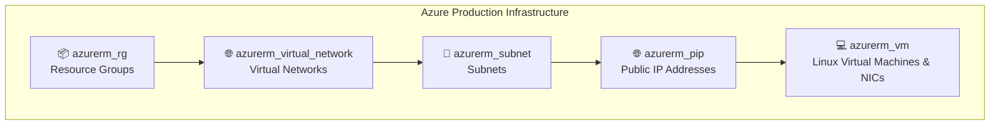

# 🚀 Azure Production Infrastructure as Code (IaC)

[](https://www.terraform.io/)
[](https://azure.microsoft.com/)
[](.github/workflows/azure-pipelines.yml)
[](.github/workflows/azure-pipelines.yml)
[](LICENSE)

An **enterprise-grade, modular Infrastructure as Code (IaC)** framework built using **Terraform** to provision and manage production infrastructure on **Microsoft Azure**. 

This repository leverages the **Child-Parent Module Architectural Pattern**, using dynamic data lookups and map iterators (`for_each`) to deploy scalable, reproducible, and secure multi-tier networking and virtual machine environments.

---

## 📋 Table of Contents

- [🌟 Features](#-features)
- [🏗️ Architectural Overview](#️-architectural-overview)
- [📁 Repository Structure](#-repository-structure)
- [🧩 Reusable Modules](#-reusable-modules)
- [🔒 Remote Backend & State Management](#-remote-backend--state-management)
- [⚙️ Prerequisites](#️-prerequisites)
- [🚀 Quick Start Guide](#-quick-start-guide)
- [🤖 CI/CD Pipeline & Security Scanning](#-cicd-pipeline--security-scanning)
- [🛡️ Security Best Practices](#️-security-best-practices)
- [📄 License](#-license)

---

## 🌟 Features

- 🧩 **Parent-Child Module Pattern**: Clean separation between reusable child infrastructure modules (`/modules`) and environment-specific declarations (`/environments/prod`).
- ⚡ **Dynamic Scale via Map Iterators**: Provisions multiple Resource Groups, VNets, Subnets, Public IPs, and Linux VMs dynamically using `for_each` and map data structures without code repetition.
- 🔗 **Decoupled Dependency Injection**: Uses Terraform `data` sources inside child modules to resolve dependencies dynamically at runtime (e.g., resolving Subnets and Public IPs for VM NIC creation).
- 🔐 **Azure Remote Backend**: Centralized and locked state management stored securely in Azure Blob Storage.
- 🛡️ **Automated Security & Compliance**: Continuous static analysis using **Checkov**, formatting enforcement with `terraform fmt`, and validation checks via automated pipelines.

---

## 🏗️ Architectural Overview

The deployment follows a strict execution dependency hierarchy managed by Terraform's module system:



### Infrastructure Provisioned:
- **Resource Groups**: Segregated containers for production workloads (`dhondhu`, `rhondu`).
- **Virtual Networks (VNets)**: Isolated cloud network boundaries with defined address spaces (`10.20.0.0/16`, `10.30.0.0/16`).
- **Subnets**: Dedicated subnetworks for Frontend (`10.20.1.0/24`) and Backend (`10.30.1.0/24`) tiers.
- **Public IPs**: Static public IP addresses assigned per environment tier.
- **Linux Virtual Machines**: Ubuntu 22.04 LTS instances configured with dynamic Network Interfaces (NICs) and secure access controls.

---

## 📁 Repository Structure

```text
Child_Parent_Prod/
├── 📁 .github/
│   └── 📁 workflows/
│       └── 📄 azure-pipelines.yml     # Automated CI/CD, Format & Checkov Security Pipeline
├── 📁 environments/
│   └── 📁 prod/                       # Production Environment Entrypoint (Parent Module)
│       ├── 📄 main.tf                 # Module orchestration & dependency chaining
│       ├── 📄 provider.tf             # Azure Provider configuration & remote Blob backend
│       ├── 📄 variable.tf             # Input variable declarations
│       └── 📄 terraform.tfvars        # Environment-specific configuration data maps
└── 📁 modules/                        # Reusable Child Modules
    ├── 📁 azurerm_rg/                 # Resource Group module
    ├── 📁 azurerm_virtual_network/    # Virtual Network module
    ├── 📁 azurerm_subnet/             # Subnet module
    ├── 📁 azurerm_pip/                # Public IP module
    └── 📁 azurerm_vm/                 # Linux Virtual Machine & NIC provisioning module
```

---

## 🧩 Reusable Modules

| Module Path | Azure Resource | Description |
| :--- | :--- | :--- |
| `modules/azurerm_rg` | `azurerm_resource_group` | Creates Azure Resource Groups dynamically from map variables. |
| `modules/azurerm_virtual_network` | `azurerm_virtual_network` | Provisions VNets connected to targeted Resource Groups. |
| `modules/azurerm_subnet` | `azurerm_subnet` | Configures isolated subnets within target VNets. |
| `modules/azurerm_pip` | `azurerm_public_ip` | Allocates static or dynamic Public IP addresses. |
| `modules/azurerm_vm` | `azurerm_linux_virtual_machine` | Deploys Linux VMs and NICs using Terraform `data` lookups. |

---

## 🔒 Remote Backend & State Management

State persistence is configured via Azure Blob Storage in `environments/prod/provider.tf`:

```hcl
terraform {
  backend "azurerm" {
    storage_account_name = "storageatfstate"
    resource_group_name  = "infosys"
    container_name       = "tfstatecontainer"
    key                  = "prod.tfstate"
  }
}
```

> **Note**: Ensure the storage account `storageatfstate` and container `tfstatecontainer` exist in your Azure subscription before running `terraform init`.

---

## ⚙️ Prerequisites

Before executing the deployment, ensure you have the following installed and configured:

1. **[Terraform CLI](https://developer.hashicorp.com/terraform/downloads)** (`>= 1.5.0`)
2. **[Azure CLI](https://learn.microsoft.com/en-us/cli/azure/install-azure-cli)** (`>= 2.50.0`)
3. **Active Azure Subscription** with appropriate RBAC permissions (Contributor / Owner).
4. **Python 3.x & Checkov** (for local security scanning):
   ```bash
   pip install checkov
   ```

---

## 🚀 Quick Start Guide

### 1️⃣ Clone the Repository
```bash
git clone https://github.com/your-username/Child_Parent_Prod.git
cd Child_Parent_Prod/environments/prod
```

### 2️⃣ Authenticate with Azure
```bash
az login
az account set --subscription "YOUR_SUBSCRIPTION_ID"
```

### 3️⃣ Initialize Terraform Workspace
Initialize the working directory and connect to the remote Azure state backend:
```bash
terraform init
```

### 4️⃣ Format & Validate Code
```bash
terraform fmt -recursive
terraform validate
```

### 5️⃣ Preview Infrastructure Changes
Generate and review the execution plan:
```bash
terraform plan
```

### 6️⃣ Deploy Infrastructure
Provision resources to Microsoft Azure:
```bash
terraform apply
```

### 7️⃣ Teardown Infrastructure (Optional)
To destroy all provisioned infrastructure:
```bash
terraform destroy
```

---

## 🤖 CI/CD Pipeline & Security Scanning

The repository includes an automated pipeline defined in `.github/workflows/azure-pipelines.yml` featuring a multi-stage validation process:

```
[ Stage 1: Security & Compliance Scan ]
   ├── ⚙️ Terraform Installer
   ├── 🔍 Terraform Init (-backend=false)
   ├── 🎨 Format Check (terraform fmt -check)
   ├── ✅ Validation (terraform validate)
   └── 🛡️ Checkov Security Scan (Static Analysis)

[ Stage 2: Plan Generation ]
   ├── ⚙️ Terraform Init (Remote Backend)
   └── 📊 Terraform Plan Execution
```

---

## 🛡️ Security Best Practices

- 🔑 **Secrets Management**: Sensitive parameters (like passwords and keys) should be injected via environment variables (`TF_VAR_*`) or integrated with **Azure Key Vault** in production workflows.
- 🔒 **State File Encryption**: State files are stored remotely in Azure Storage with at-rest encryption enabled.
- 🛡️ **Static Code Analysis**: All commits and pull requests undergo security scanning via **Checkov** to catch misconfigurations prior to deployment.

---

## 📄 License

This project is licensed under the **MIT License**. See the [LICENSE](LICENSE) file for details.

---

<p align="center">
  Made with ❤️ by <b>Abhishek Sharma</b> for DevOps & Azure Infrastructure Engineering
</p>
